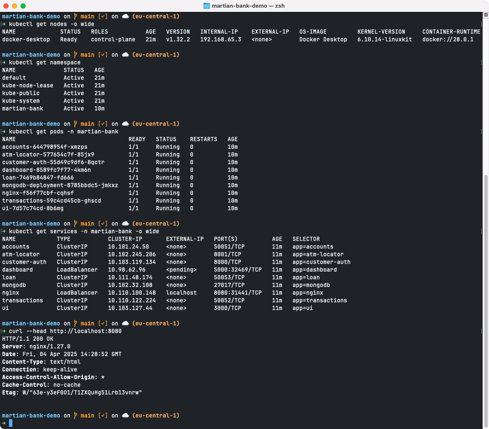
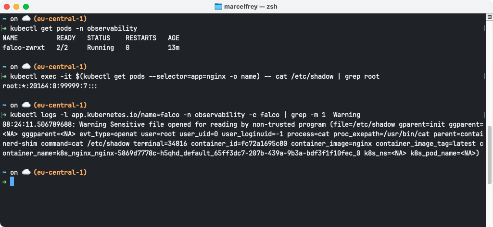

# IU-DOCC-Container-Orchestration

Container Orchestration with Kubernetes.

## Requirements

- A Kubernetes Cluster (e.g. via Docker Desktop) 
- `kubectl` must be installed
- `helm` must be installed ([Docs](https://helm.sh/docs/intro/install/))

## Deployment of the Banking App

```bash
# Make sure Kubernetes is running and check if a node is available
kubectl get nodes -o wide

# Clone the Martian Bank repository from GitHub
git clone https://github.com/cisco-open/martian-bank-demo.git

# Navigate into the Martian Bank directory
cd martian-bank-demo

# Create a namespace for the banking application
kubectl create namespace martian-bank

# Check namespaces
kubectl get namespace

# Install the Helm Chart into the "martian-bank" namespace
helm install -n martian-bank martianbank martianbank

# Check the status of Pods 
kubectl get pods -A
kubectl get pods -n martian-bank

# Get all Services
kubectl get services -A -o wide
kubectl get services -n martian-bank -o wide

# Find the IP and port to access the application
kubectl get services -n martian-bank | grep nginx
# Example Output:
# NAME            TYPE           CLUSTER-IP       EXTERNAL-IP   PORT(S)          AGE
# nginx           LoadBalancer   10.110.100.148   localhost     8080:31441/TCP   7m7s
#
# The application can be accessed with http://localhost:8080 in this example

# Check that the nginx reverse proxy of the Martian Bank Application is reachable
curl http://localhost:8080 
curl --head http://localhost:8080
```



## Security

### Falco for Cluster Scanning

Install [Falco](https://falco.org/) in Kubernetes and trigger an alarm[^2].

```bash
# Add the Falco Repository and update all repositories
helm repo add falcosecurity https://falcosecurity.github.io/charts
helm repo update

# Create a namespace for observability services
kubectl create namespace observability

# Install the Helm Chart in the "observability" namespace
helm install falco --namespace observability --set tty=true falcosecurity/falco

# Make sure Falco is running
kubectl get pods -n observability

# Get Falco Logs
kubectl logs -l app.kubernetes.io/name=falco -n observability -c falco
```

```bash
# Run a nginx container in the default namespace
kubectl create deployment nginx --image=nginx

# Read a sensitive file in the nginx container (which should trigger an alert in Falco)
kubectl exec -it $(kubectl get pods --selector=app=nginx -o name) -- cat /etc/shadow

# Check Falco Logs
kubectl logs -l app.kubernetes.io/name=falco -n observability -c falco
kubectl logs -l app.kubernetes.io/name=falco -n observability -c falco | grep Warning

# Cleanup 
kubectl delete deployment nginx
```




## Architecture Diagrams

**Monolith and Microservices**[^1]:


**Kubernetes Cluster Architecture**:


**Kubernetes Cluster Namespaces**:


**Network Isolation**:


## References

- [martian-bank-demo](https://github.com/cisco-open/martian-bank-demo)

[^1]: Based on https://github.com/cisco-open/martian-bank-demo/blob/main/images/Arch.png
