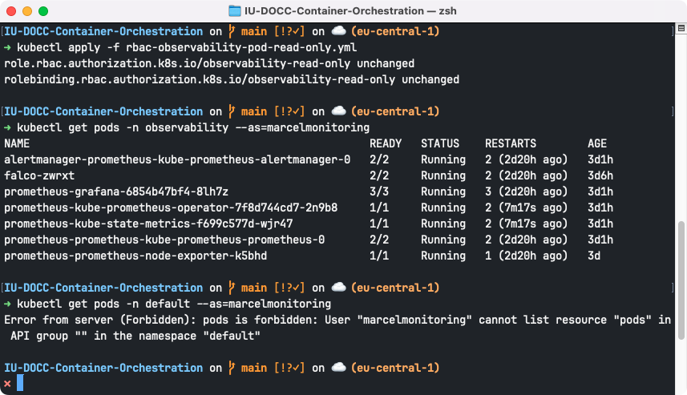
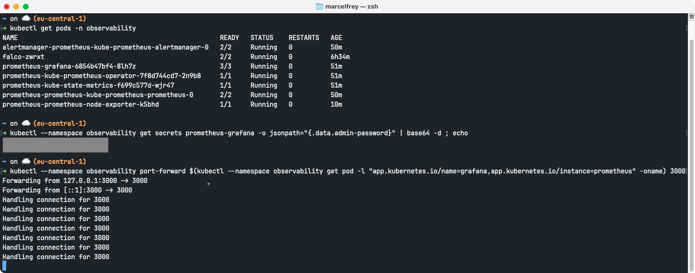
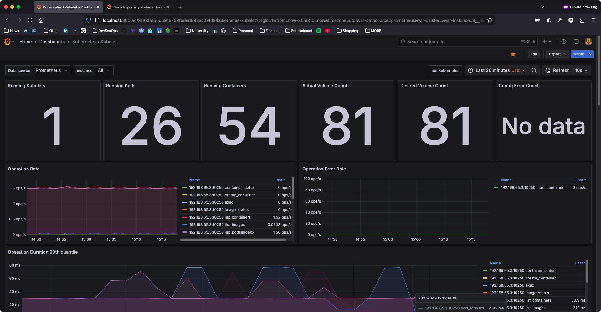
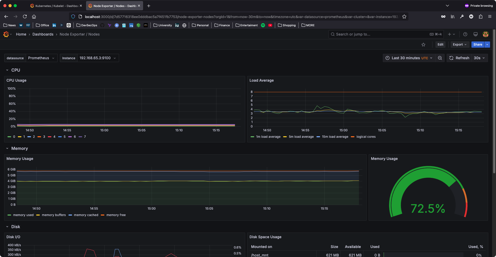

# IU-DOCC-Container-Orchestration

Container Orchestration with Kubernetes.

## Requirements

- A Kubernetes Cluster (e.g. via Docker Desktop) 
- `kubectl` must be installed
- `helm` must be installed ([Docs](https://helm.sh/docs/intro/install/))
- `trivy` must be installed ([Docs](https://trivy.dev/latest/getting-started/installation/))

## Deployment of the Banking App

```bash
# Make sure Kubernetes is running and check if a node is available
kubectl get nodes -o wide

# Clone the Martian Bank repository from GitHub
git clone https://github.com/cisco-open/martian-bank-demo.git

# Navigate into the Martian Bank directory
cd martian-bank-demo

# Create a namespace for the banking application
kubectl create namespace martian-bank

# Check namespaces
kubectl get namespace

# Install the Helm Chart into the "martian-bank" namespace
helm install -n martian-bank martianbank martianbank

# Check the status of Pods 
kubectl get pods -A
kubectl get pods -n martian-bank

# Get all Services
kubectl get services -A -o wide
kubectl get services -n martian-bank -o wide

# Find the IP and port to access the application
kubectl get services -n martian-bank | grep nginx
# Example Output:
# NAME            TYPE           CLUSTER-IP       EXTERNAL-IP   PORT(S)          AGE
# nginx           LoadBalancer   10.110.100.148   localhost     8080:31441/TCP   7m7s
#
# The application can be accessed with http://localhost:8080 in this example

# Check that the nginx reverse proxy of the Martian Bank Application is reachable
curl http://localhost:8080 
curl --head http://localhost:8080
```


## RBAC

The `rbac-observability-pod-read-only.yml` file defines a `Role` and `RoleBinding` which grant read-only access to pods in the `observability` namespace to the user `marcelmonitoring`.

```bash
# Apply the manifest
kubectl apply -f rbac-observability-pod-read-only.yml

# Try to list pods in the observability namespace with the user marcelmonitoring
# This should work
kubectl get pods -n observability --as=marcelmonitoring

# Try to list pods in the default namespace with the user marcelmonitoring
# This should not work
kubectl get pods -n default --as=marcelmonitoring
```

**Kubernetes RBAC Example**:



## Security

### Trivy for SAST and manual checks

- [Trivy](https://trivy.dev/)
    - Scan container images, project, and K8s
    - Check for vulnerabilities (CVEs), misconfigurations, and secrets
    - Provide recommendations (e.g. fixed version)
- Scans (Source[^3])
    - Image
        - Base Image
        - Dependencies (e.g. Node Packages / `package.json`)
    - Project
        - Code Dependencies (e.g. npm / `package.json`)
        - Dockerfiles
        - Kubernetes Manifests
        - Helm Charts
    - Kubernetes
        - Workload Assessment
        - Infra Assessment (The `kube-system` namespace and Nodes)
        - RBAC Assessment (checks `(Cluster)Role`s and `(Cluster)RoleBindings`)

```bash
# Scan a Container Image from the Registry
# We're using the base image of the "atm-locator" which is Node.js 14
trivy image --scanners vuln,secret,misconfig node:14

# Scan a project directory
cd martian-bank-demo
trivy fs --scanners vuln,secret,misconfig .

# Scan K8s cluster
trivy k8s --report=summary
```


### Falco for Continuous Cluster Scanning

Install [Falco](https://falco.org/) in Kubernetes and trigger an alarm[^2].

```bash
# Add the Falco Repository and update all repositories
helm repo add falcosecurity https://falcosecurity.github.io/charts
helm repo update

# Create a namespace for observability services
kubectl create namespace observability

# Install the Helm Chart in the "observability" namespace
helm install falco --namespace observability --set tty=true falcosecurity/falco

# Make sure Falco is running
kubectl get pods -n observability

# Get Falco Logs
kubectl logs -l app.kubernetes.io/name=falco -n observability -c falco
```

```bash
# Run a nginx container in the default namespace
kubectl create deployment nginx --image=nginx

# Read a sensitive file in the nginx container (which should trigger an alert in Falco)
kubectl exec -it $(kubectl get pods --selector=app=nginx -o name) -- cat /etc/shadow

# Check Falco Logs
kubectl logs -l app.kubernetes.io/name=falco -n observability -c falco
kubectl logs -l app.kubernetes.io/name=falco -n observability -c falco | grep Warning

# Cleanup 
kubectl delete deployment nginx
```
**Running Falco in Kubernetes and trigger an alert**:


**Falco alerting process and automation with Falcosidekick, Teams, Opsgenie, and Jira[^4]**:


## Observability

Observe the Kubernetes Cluster with [Prometheus](https://prometheus.io/) and [Grafana](https://grafana.com/oss/grafana/) via [Prometheus Community Helm Charts](https://github.com/prometheus-community/helm-charts/).

```bash
# Add the Repository
helm repo add prometheus-community https://prometheus-community.github.io/helm-charts
helm repo update

# Install Prometheus Helm Chart in the "observability" namespace
# 
# The Cart installs additional Tools
# - Kube Stats Metrics
# - Prometheus Node Exporter
# - Grafana
helm install prometheus --namespace observability prometheus-community/kube-prometheus-stack

# Check Pod Status
kubectl get pods -n observability

# Fix the Node Exporter in case it is in a CrashLoop due to a mount error in the logs
# 
# Example Error from the Logs: 
# failed to try resolving symlinks in path "/var/log/pods/observability_prometheus-prometheus-node-exporter-tjncm_f4e31656-9150-4975-a94d-61b04ce71af2/node-exporter/10.log": lstat /var/log/pods/observability_prometheus-prometheus-node-exporter-tjncm_f4e31656-9150-4975-a94d-61b04ce71af2/node-exporter/10.log: no such file or directory
# 
# Solution: Remove the mount (see https://github.com/prometheus-operator/kube-prometheus/discussions/790#discussioncomment-6896643)                                                
kubectl logs -n observability prometheus-prometheus-node-exporter-tjncm # Adjust to your pod name!
kubectl get ds -n observability  
kubectl patch ds -n observability prometheus-prometheus-node-exporter --type "json" -p '[{"op": "remove", "path" : "/spec/template/spec/containers/0/volumeMounts/2/mountPropagation"}]'

# Get the password for the Granfana "admin" user
kubectl --namespace observability get secrets prometheus-grafana -o jsonpath="{.data.admin-password}" | base64 -d ; echo

# Forward the Grafana Dashboard to http://localhost:3000
kubectl --namespace observability port-forward $(kubectl --namespace observability get pod -l "app.kubernetes.io/name=grafana,app.kubernetes.io/instance=prometheus" -oname) 3000
```

**Running Pods in the `observability` namespace**:


**Grafana Dashboard with Kubernetes Metrics**:



**Grafana Dashboard with Node Metrics**:



## Architecture Diagrams

**Monolith and Microservices**[^1]:


**Kubernetes Cluster Architecture**:


**Kubernetes Cluster Namespaces**:


**Network Isolation**:


## References

- [martian-bank-demo](https://github.com/cisco-open/martian-bank-demo)

[^1]: Based on https://github.com/cisco-open/martian-bank-demo/blob/main/images/Arch.png
[^2]: Based on https://falco.org/docs/getting-started/falco-kubernetes-quickstart/
[^3]: Based on https://trivy.dev/latest/getting-started/
[^4]: Based on https://github.com/falcosecurity/falcosidekick/blob/master/imgs/falco_with_falcosidekick.png
